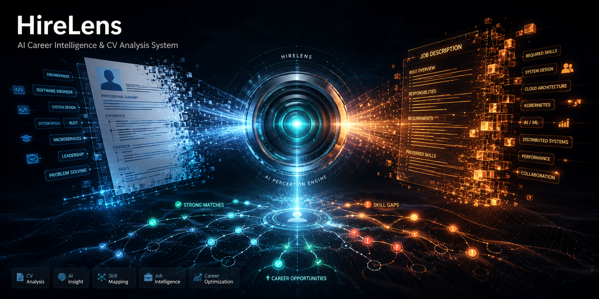

<div align="center">
  
</div>

<br />

<div align="center">

  [](LICENSE)
  [](https://www.rust-lang.org)
  [](#)
  [](#)
  [](#)
  [](#)

</div>

<br />

<div align="center">

  **[ 🇬🇧 [Read in English](README.md) &nbsp;|&nbsp; 🇫🇷 Français ]**

</div>

---

> ⚠️ **Ce projet est en cours de développement actif. Des changements importants sont à prévoir.**

### Qu'est-ce que HireLens ?

**HireLens** est un outil CLI production-ready qui analyse des CVs face à des offres d'emploi via un scoring ATS et une assistance IA — et produit des CVs optimisés **sans hallucinations**.

Le principe fondamental : **les LLMs ne retournent que du JSON structuré. Rust valide chaque adaptation et génère le CV final.** Pas de compétences inventées. Pas d'expériences fabriquées. Jamais.

---

### ✨ Fonctionnalités

| Fonctionnalité | Description |
|---|---|
| 🎯 **Score ATS** | Matching de compétences via HashSet, score normalisé 0–100 |
| 🤖 **Multi-Provider LLM** | OpenAI, Ollama, LM Studio — un seul flag pour changer |
| 🔒 **Anti-Hallucination** | Chaque compétence et bullet adaptée est validée contre le CV original |
| 📴 **Mode Hors-ligne** | Audit et adaptation complets sans aucun appel LLM |
| 💾 **Cache intelligent** | Réponses LLM hashées SHA-256, stockées dans `.cache/` |
| 🔏 **Privacy-First** | Mode local pur avec Ollama ou LM Studio |
| 📄 **Export propre** | Markdown rendu par des templates Rust ; PDF optionnel via Pandoc |
| 📊 **Sortie JSON** | Flag `--json` pour intégration CI/CD |

---

### 🏗 Architecture

```
src/
├── cli/        # Commandes clap : audit, adapt, build
├── llm/        # Trait LLM + providers OpenAI / Ollama / LM Studio
├── core/       # Scoring ATS, extraction de compétences, validation, pipeline
├── parser/     # Parseur Markdown + frontmatter YAML
├── export/     # Moteur de rendu Rust + pont PDF Pandoc
└── utils/      # Chargement config (TOML + env), cache SHA-256
```

**Pipeline :**

```
CV (Markdown+YAML) ──► Parse ──► Extraction compétences (LLM → JSON)
                                        │
Offre d'emploi ─────► Parse ──► Score ATS (Rust)
                                        │
                              Génération adaptation (LLM → JSON)
                                        │
                              Validation (aucune nouvelle compétence) ◄── REJET si hallucination
                                        │
                              Rendu CV final (template Rust)
                                        │
                              Sortie Markdown / PDF
```

---

### 🚀 Installation

**Prérequis :** [Rust toolchain](https://rustup.rs/) 1.75+

```bash
git clone https://github.com/Rwanbt/HireLens.git
cd HireLens
cargo build --release
# Binaire : ./target/release/hirelens
```

Ajout au PATH :
```bash
# Linux / macOS
export PATH="$PATH:$(pwd)/target/release"

# Windows (PowerShell)
$env:PATH += ";$(pwd)\target\release"
```

---

### 📖 Utilisation

#### `audit` — Analyse ATS

```bash
# Rapport lisible (mode hors-ligne, sans LLM)
hirelens audit examples/cv.md examples/job.txt --offline

# Sortie JSON pour CI/CD
hirelens audit examples/cv.md examples/job.txt --offline --json

# Échoue si le score est sous le seuil
hirelens audit examples/cv.md examples/job.txt --offline --min-score 70
```

**Exemple de sortie :**
```
ATS audit

Score: 63/100
Skill match: 62%

Matched skills: docker, kubernetes, postgresql, rust, tokio
Missing skills: ci/cd, llm, rest
```

#### `adapt` — Génération du CV optimisé

```bash
# Adaptation en mode hors-ligne
hirelens adapt examples/cv.md examples/job.txt --offline --output cv-optimise.md

# Afficher le diff entre le CV original et adapté
hirelens adapt examples/cv.md examples/job.txt --offline --diff --min-score 60

# Utiliser un LLM cloud
hirelens adapt examples/cv.md examples/job.txt --provider openai --output cv-optimise.md
```

#### `build` — Rendu propre du CV

```bash
# Rendu en Markdown
hirelens build examples/cv.md --output cv.md

# Rendu en PDF (nécessite Pandoc)
hirelens build examples/cv.md --output cv.pdf --pdf
```

#### `gui` — Interface graphique

```bash
hirelens gui
```

---

### 🤖 Providers LLM

| Provider | Flag | URL par défaut | Auth |
|---|---|---|---|
| **OpenAI** | `--provider openai` | `https://api.openai.com/v1` | Variable `OPENAI_API_KEY` |
| **Ollama** | `--provider ollama` | `http://localhost:11434` | Aucune |
| **LM Studio** | `--provider lmstudio` | `http://localhost:1234/v1` | Aucune |

```bash
# OpenAI
export OPENAI_API_KEY="sk-..."
hirelens audit cv.md job.txt --provider openai

# Ollama (Ollama doit tourner en local)
hirelens audit cv.md job.txt --provider ollama

# LM Studio (serveur LM Studio doit être démarré)
hirelens audit cv.md job.txt --provider lmstudio
```

---

### ⚙️ Configuration

Copier le fichier exemple et l'adapter :

```bash
cp hirelens.example.toml hirelens.toml
```

```toml
# hirelens.toml
provider = "ollama"       # provider par défaut
offline = false           # mode hors-ligne privacy-first
cache = true              # mise en cache des réponses LLM
cache_dir = ".cache"
timeout_seconds = 60

[openai]
model = "gpt-4o-mini"
base_url = "https://api.openai.com/v1"

[ollama]
model = "llama3.1"
base_url = "http://localhost:11434"

[lmstudio]
model = "local-model"
base_url = "http://localhost:1234/v1"
```

**Surcharges par variables d'environnement :**

| Variable | Description |
|---|---|
| `OPENAI_API_KEY` | Clé API OpenAI |
| `OPENAI_MODEL` | Surcharge le modèle OpenAI |
| `OLLAMA_MODEL` | Surcharge le modèle Ollama |
| `OLLAMA_BASE_URL` | Surcharge l'URL Ollama |
| `LMSTUDIO_MODEL` | Surcharge le modèle LM Studio |
| `LMSTUDIO_BASE_URL` | Surcharge l'URL LM Studio |
| `HIRELENS_CONFIG` | Chemin vers un fichier de config personnalisé |

---

### 🔒 Système Anti-Hallucination

HireLens applique des règles strictes à chaque étape :

1. **Sortie LLM JSON uniquement** — le modèle est contraint à retourner du JSON structuré, jamais du texte libre
2. **Liste blanche de compétences** — chaque compétence dans le CV adapté doit exister dans le CV original
3. **Validation des bullets** — chaque bullet adapté doit être traçable à un bullet original
4. **Rendu Rust** — le texte final du CV est assemblé par des templates Rust, pas par le LLM
5. **Visibilité du diff** — le flag `--diff` expose chaque changement entre l'original et l'adapté

```
Compétences CV original : [Rust, Docker, Kubernetes, PostgreSQL]
LLM propose :             [Rust, Docker, Kubernetes, PostgreSQL, Go]  ← REJETÉ
Sortie validée :          [Rust, Docker, Kubernetes, PostgreSQL]      ✓
```

---

### 🧪 Tests

```bash
cargo test
# 17 tests passés — cli, llm, core, parser, export, utils
```

---

### 📋 Format du CV

HireLens attend un fichier Markdown avec un bloc frontmatter YAML :

```markdown
---
name: Jean Dupont
headline: Ingénieur Backend Senior
summary: Ingénieur systèmes spécialisé dans les services distribués fiables.
skills:
  - Rust
  - Docker
  - Kubernetes
experience:
  - id: exp-1
    company: Acme Corp
    role: Ingénieur Backend
    start: "2020"
    end: Present
    bullets:
      - Conçu des microservices avec Rust et Tokio.
education:
  - institution: École Polytechnique
    degree: Diplôme d'ingénieur
    year: "2018"
---
```

---

### 📄 Licence

[MIT](LICENSE) — © 2026 HireLens

---

<div align="right">

**[🔝 Retour en haut](#)**

</div>
